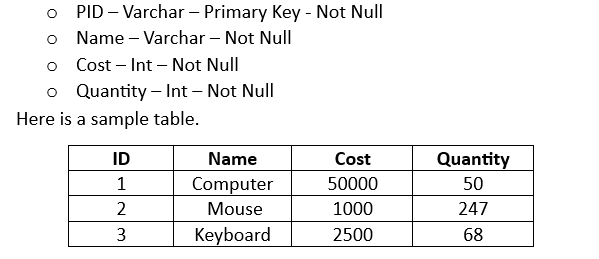

## Inventory Management System

### Overview
This Java-based app helps manage inventory records with an easy-to-use interface. It simplifies tasks related to inventory management.

## Sample Inventory

...

### Table of Contents
- Features
- To-Do List
- About the Application
- Getting Started
- Usage
- Technologies Used
- Contributing

### Features
- Front-End GUI:
  - User-friendly interface for easy interaction.
  - Seamless connection between front-end and back-end.
- Database Creation:
  - Structured database to manage inventory records.
  - Add, update, and delete records efficiently.
- Back-End Logic:
  - Core functionality implementation.
- Testing:
  - Rigorous testing for reliability.

### To-Do List
- Front-End GUI:
  - Design and implement the interface.
  - Establish communication between front-end and back-end.
- Create Database:
  - Set up inventory record storage.
  - Develop functions for record manipulation.
  - Implement core back-end logic.
- Testing:
  - Perform comprehensive testing.

### About the Application
The Inventory Management System simplifies inventory record management using Java. It's intuitive and efficient for businesses or individuals streamlining inventory processes.

### Getting Started
1. Clone the repository to your machine.
2. Install necessary dependencies.
3. Ensure your database is set up with the following details:
    - URL: [Replace_with_your_database_URL]
    - Database Name: [Replace_with_your_database_name]
    - Username: [Replace_with_your_database_username]
    - Password: [Replace_with_your_database_password]
4. Make sure the database contains the required columns:
    - "Id"
    - "Name"
    - "Cost"
    - "Quantity"
5. Launch the application.

### Usage
- Use the interface for inventory tasks.
- Add, update, or delete records as needed.

### Technologies Used
- Java: Core programming language.
- Swing: Java GUI toolkit.
- Database System: MySQL

### Contributing
Contributions welcome! Follow the guidelines in CONTRIBUTING.md to contribute to the system's development.
